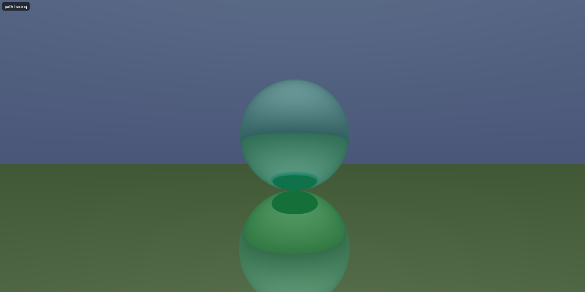
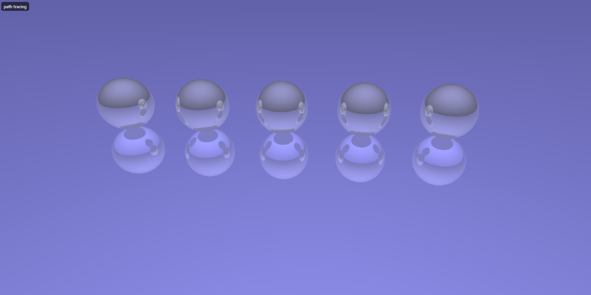
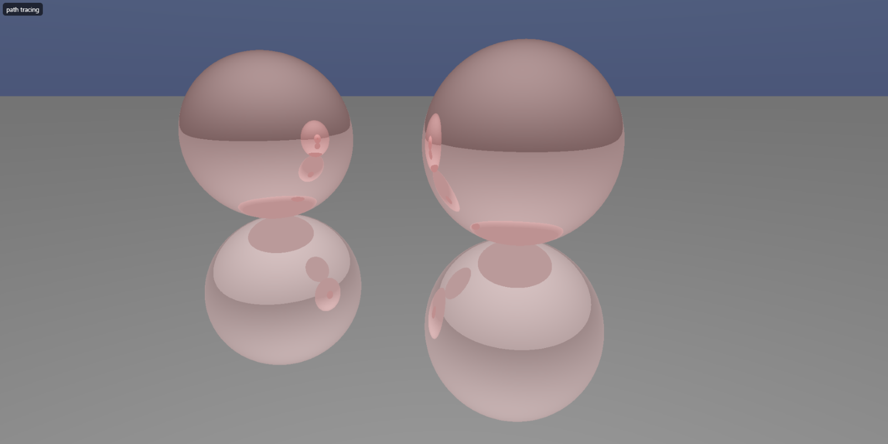

# simple ray tracer

a simple real time ray tracer. Made using WebGPU (WGSL) and TypeScript.

## demo screenshots:

|                                                       |
| ----------------------------------------------------- |
|      |
|  |
|    |

## building

- open folder
- make sure you install required dependencies via npm
- run using vite 'npm run dev'
